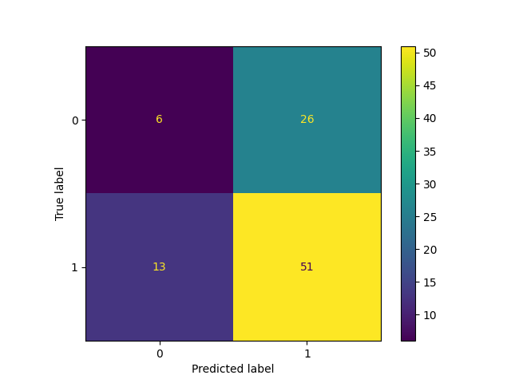

# 🧾 Loan Approval Prediction with MLflow Tracking

A machine learning project for predicting loan approval status using classification models, integrated with **MLflow** for experiment tracking and model versioning.

---

## 🚀 Highlights

- 📊 Dataset: Real-world structured loan application data with 13 features
- 🔎 Features: Gender, Marital Status, Income, Loan Amount, Credit History, etc.
- 🧼 Preprocessing: Missing value handling, binary encoding, feature selection
- 🤖 Models Used:
  - Random Forest Classifier
  - K-Nearest Neighbors (KNN)
- 🧪 Evaluation: Accuracy score, confusion matrix
- 📈 Experiment Tracking: MLflow logging for parameters, metrics, models, and artifacts
- 🔁 Hyperparameter Tuning: `n_estimators` and `max_depth` for Random Forest

---

## 📂 Dataset Overview

| Column             | Description                      |
|--------------------|----------------------------------|
| Gender             | Applicant's gender               |
| Married            | Marital status                   |
| ApplicantIncome    | Applicant's income               |
| LoanAmount         | Requested loan amount            |
| Credit_History     | Credit score history (binary)    |
| Loan_Status        | **Target** – Loan approved (Y/N) |

- 430 entries, with missing values handled via `dropna()`

---

## 🧠 Model Training

- **Baseline Model**: Random Forest (`max_depth=4`)
- **Train/Test Split**: 80/20
- **Initial Accuracy**:
  - Train: 81.3%
  - Validation: 73.1%

---

## 🧪 MLflow Integration

Every training run is logged with:

- `mlflow.log_param(...)`: model parameters like depth, n_estimators
- `mlflow.log_metric(...)`: training and validation accuracy
- `mlflow.sklearn.log_model(...)`: model version saved to MLflow
- `mlflow.set_tag(...)`: tag experiments and data files
- `mlflow.log_artifact(...)`: save plots like confusion matrix

---

## 🔁 Hyperparameter Tuning

Used `mlflow_runs(n_est, max_depth, i)` to:

- Train multiple RF models with varying configurations
- Log all performance metrics and parameters to MLflow
- Easily compare runs in MLflow UI

Sample configs:

```
n_estimators: [10, 20, 40]
max_depth: [2, 4, 8]
```

---

## 🔍 KNN Model

- Trained with `n_neighbors=5`
- Accuracy logged via MLflow
- Confusion matrix generated and saved as image artifact

---

## 📈 Visualization Example

  
*(Auto-logged to MLflow artifacts)*

---

## 📦 How to Run

```bash
pip install pandas numpy scikit-learn mlflow matplotlib
python train.py  # Or run interactively in Jupyter
```

Make sure MLflow is running in tracking mode:

```bash
mlflow ui
```

---

## 📊 MLflow Dashboard

Accessible at: `http://localhost:5000`

- Compare model performance
- Track experiment versions
- View saved model artifacts

---

## 📜 License

MIT – free to use and modify for educational purposes.

---

## 🙌 Acknowledgements

- [MLflow](https://mlflow.org/)
- [scikit-learn](https://scikit-learn.org/)
